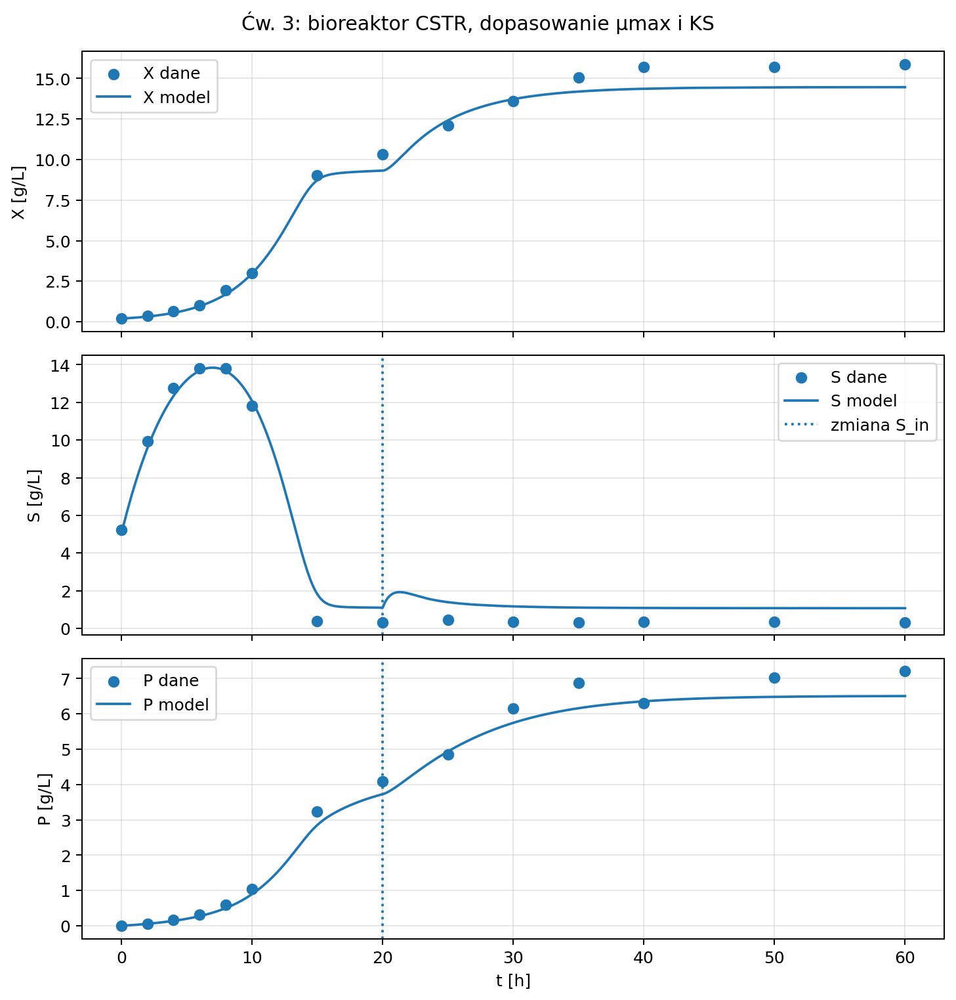
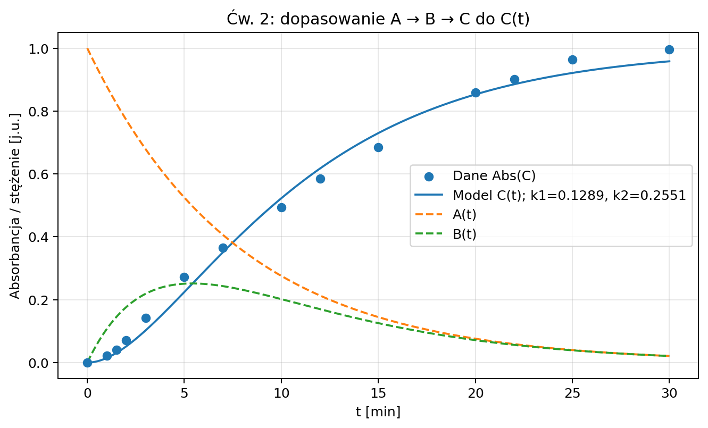
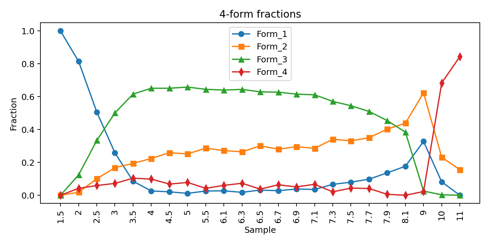

# Modelling biochemical processes: kinetics, CSTR reactors, bioreactors and spectral speciation

**MSc coursework.** Fitting mechanistic models (rate laws, CSTR and chemostat mass balances, acid–base speciation) to noisy data in Python. Every parameter comes with a bootstrap uncertainty, and competing models are compared with AIC/BIC.



## Context & motivation

Process and bioprocess engineering, and also pharmacokinetics, rely on small mechanistic models whose parameters are estimated from noisy measurements: rate constants, the maximum growth rate μ<sub>max</sub>, the affinity constant K<sub>S</sub>, pKa values. A point estimate is not enough. One needs to know:
- how well the data constrain each parameter,
- whether a simpler model explains the data equally well,
- which measurement actually carries the information.

The course trained exactly that: building ODE and mass-balance models in Python, fitting them by least squares, and judging the fits.

## Key results

| Problem | Result |
|---|---|
| A → C kinetics (true k = 0.2 min⁻¹) | k = 0.199 min⁻¹, bootstrap 95 % CI 0.179–0.222 |
| A → B → C, fitted to intermediate B (true k₁ = 0.5, k₂ = 0.1) | k₁ = 0.465 (CI 0.436–0.507), k₂ = 0.103 (CI 0.097–0.109) |
| Model choice on A → C data | one-step model preferred (AIC −83.3 vs −81.3 for two-step) |
| Model choice on A → B → C (product C) data | two-step model clearly preferred (AIC −94.6 vs −75.0) |
| Chemostat (Monod), default noise | μ<sub>max</sub> = 0.549 h⁻¹, K<sub>S</sub> = 1.87; washout above D ≈ 0.50–0.52 h⁻¹ |
| Chemostat, higher noise | μ<sub>max</sub> = 0.500 h⁻¹, K<sub>S</sub> = 0.82: K<sub>S</sub> is poorly determined |
| Spectral speciation (pKa, LOO-validated) | Ledakrin 6.24 / 9.32; Symadex 2.81 / 7.63 / 9.61; C-2045 2.43 / 6.12 / 7.16 / 9.63 |

**What these show:**
- **Product data:** the concentration of the end product C in A → B → C is symmetric in k₁ and k₂. Fitting to C alone cannot tell which step is the fast one, and its bootstrap intervals are wider. Measuring the intermediate B pins both constants down.
- **Noise:** K<sub>S</sub> becomes unreliable as noise grows, while μ<sub>max</sub> stays stable.
- **Leave-one-out:** LOO exposes a weakly determined pKa (Ledakrin pKa₂: LOO SD 1.40 vs ≤ 0.18 for the other values).

<p>


</p>

## Method

- **Reaction kinetics (lab 2):**
  - least-squares fits (`scipy.optimize.least_squares`) for A → C and A → B → C,
  - bootstrap resamples per fit (300 for lab 2, 200 for the CSTR fits, 20 for the chemostat),
  - model comparison of free vs constrained (k<sub>max</sub>) fits by SSE, AIC and BIC.
- **CSTR reactors (lab 3):**
  - steady-state and dynamic (`solve_ivp`) models for A → P and A → B → C,
  - conversion vs residence time,
  - fitting rate constants to outlet concentrations.
- **Chemostat (lab 3):** Monod kinetics for biomass X, substrate S and product P; fitting μ<sub>max</sub> and K<sub>S</sub>; critical dilution rate and washout.
- **Spectral speciation (labs 4–5):**
  - PCA of absorbance spectra across pH to count the acid–base forms,
  - fitting species fractions and pKa, with leave-one-out validation,
  - self-association and complexation models.

## How to run

`mpb_compute.py` imports the simulation and fitting programs that the course instructors provided. Those programs are not redistributed here. To reproduce the results, put them in `Laby/` (or point `MPB_LABS_DIR` at them) and run:

```bash
pip install -r requirements.txt
python mpb_compute.py        # writes results/ (figures, tables, results*.json)
```

All generated outputs are committed in [`results/`](results/).

## Repository structure

```
mpb_compute.py   batch driver: runs all exercises, fits models, bootstraps, saves figures/tables/JSON
results/         generated data (CSV), figures (PNG), tables, results*.json
reports/         lab reports (Polish): kinetics and reactors, bioreactors, spectral speciation
```

## Data

None of the data are sensitive.
- The kinetics, reactor and bioreactor "measurements" are synthetic: the course programs simulate them with added measurement noise of 2–10 %.
- The spectral example datasets (Ledakrin, Symadex, C-2045) and the lab programs are course materials. They are available to course participants from the instructors and are not included.

## Scope

- **Set by the course:**
  - the lab programs (data simulators and template fitting scripts),
  - the exercise list in the lab instructions,
  - written lab reports.
- **My decisions:**
  - running all exercises in one batch driver with automatic paths,
  - bootstrap confidence intervals and AIC/BIC model comparison throughout,
  - the interpretation in the reports.

  Changes to the course scripts were technical only (automatic file paths, saving figures, analytical solutions of the same linear ODEs to speed up bootstrapping). The models and equations were not changed.

## AI usage

AI-assisted development was used for implementation and documentation. Method choice, validation strategy, data-handling decisions, result verification and interpretation were reviewed and owned by me. Specifically, I checked fitted constants against the simulation's true values and read the bootstrap and LOO spreads to judge which parameters the data actually determine.

## License

Code: MIT (see [LICENSE](LICENSE)). Course programs and example spectra are not included and are not covered by this licence.

---

## 🇵🇱 Opis po polsku

Ćwiczenia z przedmiotu *Modelowanie procesów biochemicznych* (kierunek InfoBioChem, studia II stopnia, Politechnika Gdańska, 2026).

- **Kinetyka reakcji:** dopasowanie stałych szybkości, przedziały ufności z bootstrapu, wybór modelu przez AIC/BIC.
- **Reaktory CSTR:** stan ustalony i dynamika.
- **Bioreaktor z kinetyką Monoda:** μ<sub>max</sub>, K<sub>S</sub>, wymywanie.
- **Specjacja z widm:** PCA, pKa, walidacja LOO.

Najważniejsze wnioski:
- z pomiaru produktu C nie da się rozróżnić k₁ i k₂ (pomiar produktu pośredniego B to umożliwia),
- K<sub>S</sub> staje się niepewne przy większym szumie,
- LOO wskazuje słabo wyznaczone pKa.

Sprawozdania są w folderze `reports/`.

**Wsparcie AI:** kod i dokumentacja powstały z pomocą narzędzi AI. Wybór metody, strategia walidacji, weryfikacja i interpretacja wyników należały do mnie.
